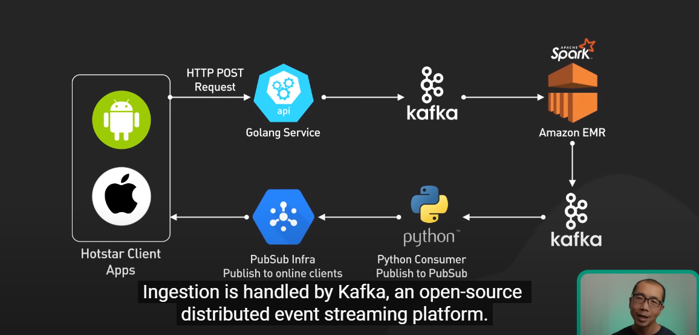

# disney-hotstars-mini

This is a mini setup of the disney emoji architecture to understand more about the use cases of streaming data fast with kafka from the frontend all the way into the db and back into the frontend to showcase the product

## Design Perspective

Inspired from [ByteGoGo Disney Architecture](https://www.youtube.com/watch?v=UN1kW5AHid4), this inspired this project to replicate the use of kafka inside long streaming services. The setup of how disney handles their whole ecosystem is as shown below.

### Scaled Down Architecture

This will be the scaled down version of the architecture stated above. Instead of using a large database called spark, we will replace it with MinIO just to store the data as the high amount of data need not be replicated. This will however require a lot of effort to make the service to work. We will be skipping the process of making a very long winded frontend Application. Instead we will only be listening to the websocket on the frontend to showcase the results. The data passed into the backend will be thought thoroughly when there are enough efforts to make this backend a reality.

  

### Final Version

The simple scaled down version will be devolved to this:

  

